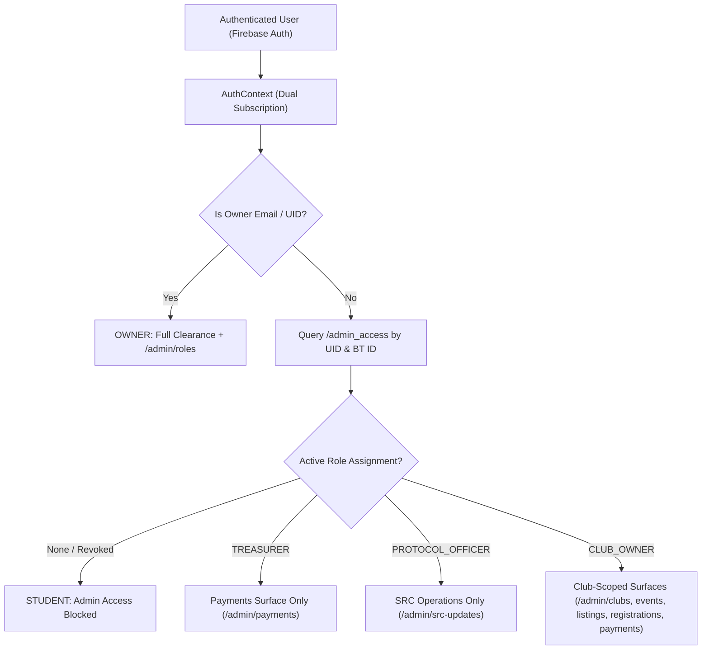

# Role-Based Access Control (RBAC) System Architecture

## Overview

The Student Representative Council (SRC) JDCOEM Web Platform enforces a strict, owner-controlled, Firestore-authoritative Role-Based Access Control (RBAC) system. 

Administrative access is managed exclusively by the **Owner** via institutional student **BT IDs** (e.g., `BT22CSE045`). Appointees never obtain administrative privileges through unvetted client-side state, designation badges, or `localStorage` caches.

---

## Authorization Model & Roles Matrix

| Role | Admin Surfaces | Scope & Capabilities |
| :--- | :--- | :--- |
| **Owner** | **FULL ACCESS** (All 14 Admin surfaces, including Roles tab) | • Unrestricted read/write across all collections and modules.<br>• Full control over role provisioning, editing, and revocation.<br>• Master tenure synchronization and hardcoded break-glass identities. |
| **Treasurer** | **Payments Page Only** (`/admin/payments`) | • Real-time UPI & Paytm financial ledger review.<br>• Transaction approvals, refund processing, and Excel export.<br>• Payment Gateway settings and UPI QR configuration.<br>• Strictly blocked from events, clubs, listings, and council management. |
| **Protocol Officer** | **SRC Operations Page Only** (`/admin/src-updates`) | • SRC Dispatches, student broadcasts, and priority notifications.<br>• Council updates, emergency notices, and dispatch forms management.<br>• Strictly blocked from payments, events, clubs, and registrations. |
| **Club Owner** | **Assigned Club Scoped** (`/admin/clubs`, `/admin/events`, `/admin/listings`, `/admin/registrations`, `/admin/payments`) | • **Clubs**: View and edit details for their assigned club only; cannot delete clubs, add new clubs, or change sequencing.<br>• **Events**: Create and edit events strictly under their assigned club (`organizerClubSlug === clubSlug`).<br>• **Engagement Hub**: Create and manage listings/forms strictly under their club.<br>• **Registrations**: Inspect and export student responses and registrations strictly for their club's events and listings.<br>• **Payments**: Inspect financial transactions and revenues strictly for their club's paid events; cannot modify payment gateway settings. |

---

## Dual-Keyed Firestore Schema (`/admin_access/{accessId}`)

Role assignments are dual-indexed by **BT ID** (human-auditable and primary) and **UID** (immutable Firebase Auth enforcement):

```ts
interface AdminAccessAssignment {
  uid: string;           // Firebase Auth UID (linked upon student sign-in)
  btId: string;          // Official College BT ID (e.g. BT22CSE045, uppercase)
  role: "OWNER" | "TREASURER" | "PROTOCOL_OFFICER" | "CLUB_OWNER";
  clubId?: string;       // Assigned Club ID (for CLUB_OWNER)
  clubSlug?: string;     // Assigned Club Slug (for CLUB_OWNER)
  clubName?: string;     // Assigned Club Name (for CLUB_OWNER)
  tenureId?: string;     // Council Tenure ID
  active: boolean;       // Status flag (false = revoked)
  grantedBy: string;     // Owner email or UID who provisioned the clearance
  grantedAt: string;     // ISO-8601 timestamp
  updatedAt: string;     // ISO-8601 timestamp
}
```

### Dual-Key Indexing Benefits:
1. **Zero-Wait Pre-Provisioning**: The Owner can provision access to BT IDs before students ever register or sign in to the website.
2. **Instant Auth Activation**: When the student registers or completes their profile with their BT ID, `AuthContext` instantly detects the assignment and grants clearance.
3. **Sub-Second Revocation**: Revoking by BT ID sets `active: false` across both documents, and live snapshot listeners instantly revoke administrative navigation and capabilities.

---

## Enforcement Architecture



### 1. Route Gating & Automatic Redirection (`src/app/admin/layout.tsx`)
- Every admin page route is verified against `adminRouteCapabilities(pathname)` and `hasAdminCapability(adminAccess, capability)`.
- If a non-owner navigates to `/admin`, they are automatically redirected to their role's home surface:
  - Treasurer → `/admin/payments`
  - Protocol Officer → `/admin/src-updates`
  - Club Owner → `/admin/clubs`
- Non-permitted routes show an Access Restricted view with a "Return to [Role] Console" button, preventing dead loops.

### 2. Sidebar Filtering (`src/components/admin/AdminSidebar.tsx`)
- Navigation items are strictly filtered by role capabilities.
- The "Roles" tab is visible exclusively to the Owner (`ownerOnly: true`).
- The sidebar displays the active administrator's role and assigned club badge.

### 3. Firestore Security Rules (`firestore.rules`)
- `/admin_access/{accessId}`: Write access is restricted exclusively to `isOwner()`. Read access is permitted only for the Owner or the authenticated user matching `uid` or `btId`.
- `/events/{eventId}`: Privileged admins have full write access; Club Owners can write only if the event's `organizerClubSlug` matches their assigned `clubSlug`.
- `/site_content/{docId}`: Club Owners can update only `clubs` and `listings`; Treasurers can update `payment_config`; Protocol Officers can update dispatch collections.
- `/registrations/{regId}`: Status and refund mutations are guarded to privileged admins, treasurers, and club owners.

---

## Owner Workflows (`/admin/roles`)

### 1. Tenure Start Single-Click Provisioning
- The Owner navigates to **Admin → Roles**.
- Click **"Grant Detected Tenure Access (1-Click)"**.
- The system automatically scans active rosters across:
  - All chartered clubs (detects Head and Co-Head BT IDs).
  - Council roster (detects Treasurer and Protocol Officer BT IDs).
- All detected appointees are provisioned in Firestore in parallel.

### 2. Inline Manual BT ID Adjustments
- Each Club card displays the auto-detected Head and Co-Head with an editable BT ID field.
- If a leader changes or has a missing/incorrect BT ID, the Owner simply types the correct BT ID and clicks **Grant** / **Update BT ID**.
- Dedicated cards for Treasurer and Protocol Officer allow immediate inline BT ID edits.

### 3. Manual Custom Grants
- A dedicated form allows assigning any role and club scope to an arbitrary BT ID.

### 4. Live Revocation
- Clicking **Revoke Access** on any card or in the Active Assignments ledger immediately updates Firestore.
- The appointee's browser session is downgraded without requiring a page refresh.
